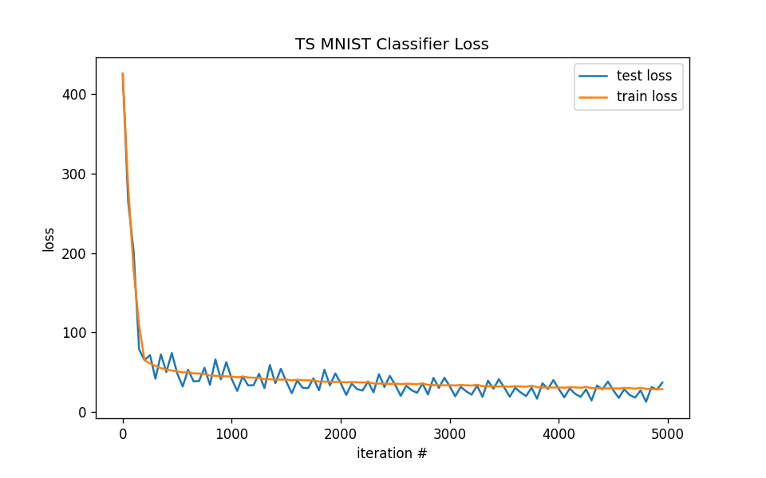
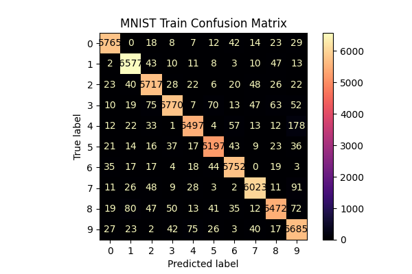
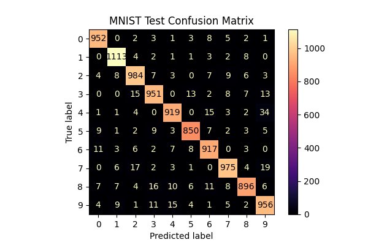

# tensorslow-experimentation
Currently we are performing experiments on the MNIST dataset. Here are some initial results on our classifier.
### Installation

First download the code from the repository
```shell
git clone git@github.com:oortega20/tensorslow.git
```

To install the current release of Tensorslow
```shell
python -m pip install -e tensorslow
```

### Tensorslow MNIST Classifier usage
```python
from tensorslow.datasets import MNIST
from tensorslow.models import ts_mnist_classifier

model = ts_mnist_classifier(from_ts=True)
data = MNIST(load_train=False, load_test=True, batch_size=128)
x_test, y_test = data.get_test_data()
for x, y in zip(x_test, y_test):
    probs = model.forward(x) # if we only want the class probabilities
    loss, grad = model.forward(x, y) # if we want to compute losses and gradients
```

### Architecture

Our model is a two layer dense network with relu-activations. Here is the summary of the architecture below.
| name    | weight names   | weight shapes        |   #parameters |
|---------|----------------|----------------------|---------------|
| MODEL   |                |                      |         79510 |
| x_1     | ('w', 'b')     | ((784, 100), (100,)) |         78500 |
| Relu    | (None,)        | (None,)              |             0 |
| x_2     | ('w', 'b')     | ((100, 10), (10,))   |          1010 |
| Softmax | (None,)        | (None,)              |             0 |
### Experimental Setup

In training the tensorslow model for classification on the MNIST Dataset, the default hyper-parameters as as follows: the training-steps is 4,680 with batch-size 128. We trained our model using SGD as the optimization methodology with learning-rate $\lambda=5e-4$ (chosen via some fiddling/trial and error). 



### Results
Our initial training setup has proved to be successful with a final accuracy of **95%** on the test dataset for MNIST. Our model is best able to recognize the digit 1 and is least able to recognizing the digit 8. We have detailed summaries of our results in the graphs below.

**Train Accuracy**
| DIGIT   |   ACC RATE (%) |
|---------|----------------|
| 0       |          0.974 |
| 1       |          0.978 |
| 2       |          0.961 |
| 3       |          0.942 |
| 4       |          0.943 |
| 5       |          0.96  |
| 6       |          0.973 |
| 7       |          0.964 |
| 8       |          0.937 |
| 9       |          0.957 |
| TOTAL   |          0.957 |


**Test Accuracy**

| DIGIT   |   ACC RATE (%) |
|---------|----------------|
| 0       |          0.974 |
| 1       |          0.981 |
| 2       |          0.954 |
| 3       |          0.942 |
| 4       |          0.939 |
| 5       |          0.954 |
| 6       |          0.958 |
| 7       |          0.949 |
| 8       |          0.923 |
| 9       |          0.948 |
| TOTAL   |          0.95  |


## Future Work
We plan to implement and perform experiments using the various activation functions mentioned in [[1]](https://doi.org/10.20944/preprints202301.0463.v1.) for use within tensorslow. Be on the lookout for results of experiments within our tensorslow experimentation repository [here](https://github.com/oortega20/tensorslow-experimentation). We also plan to perform experiments with the optimizers included within the tensorslow framework.


[1] Pishchik, E. Trainable Activations for Image Classification. Preprints 2023, 2023010463. https://doi.org/10.20944/preprints202301.0463.v1.
